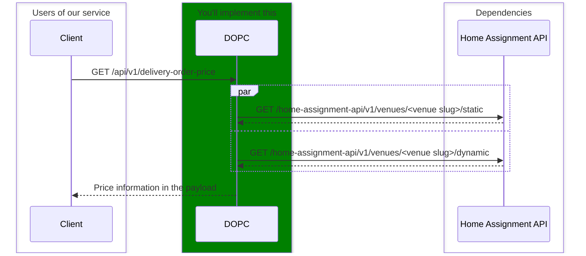

# Wolt Junior Software Engineer Programme 2024

Welcome to the 2024 Junior Software Engineer Program home assignment!
If you received a message from the recruiter saying that you made it to the home assignment, congratulations — now it's your time to shine!

The goal of the assignment is to showcase your coding skills and ability to develop realistic features.
This is a highly important part of the hiring process, so it's crucial to put effort into this without making it too bloated.
Reviewers will put weight on two main aspects: correctness and maintainability.
Based on the results of the assignment review, we will make the decision on whether to proceed to the technical interview.

**Please implement the solution in Kotlin or Scala; other languages will not be considered this time.**

<p align="center" border="none">
  
</p>


## Delivery Order Price Calculator service (DOPC)

Your task is to implement the Delivery Order Price Calculator service, or DOPC for short!
DOPC is an imaginary backend service which is capable of calculating the total price and price breakdown of a delivery order.
DOPC integrates with the Home Assignment API to fetch venue related data required to calculate the prices.
The term _venue_ refers to any kind of restaurant / shop / store that's in Wolt.
Let's not make strict assumptions about the potential clients of DOPC: they might be other backend services, Wolt's consumer mobile apps, or even some third parties which integrate with Wolt.

Here's a simple illustration of the whole system:



### Specification

The DOPC service should provide a single endpoint: GET _/api/v1/delivery-order-price_, which takes the following as query parameters (**all are required**):
* `venue_slug` (string): The unique identifier (slug) for the venue from which the delivery order will be placed
* `cart_value`: (integer): The total value of the items in the shopping cart
* `user_lat` (number with decimal point): The latitude of the user's location
* `user_lon` (number with decimal point): The longitude of the user's location

So, an example request to DOPC could look like this:
```
curl http://localhost:8000/api/v1/delivery-order-price?venue_slug=home-assignment-venue-helsinki&cart_value=1000&user_lat=60.17094&user_lon=24.93087
```

The endpoint should return a JSON response in the following format:
```json
{
  "total_price": 1190,
  "small_order_surcharge": 0,
  "cart_value": 1000,
  "delivery": {
    "fee": 190,
    "distance": 177
  }
}
```
where
* `total_price` (integer): The calculated total price
* `small_order_surcharge` (integer): The calculated small order surcharge
* `cart_value` (integer): The cart value. This is the same as what was got as query parameter.
* `delivery` (object): An object containing:
  * `fee` (integer): The calculated delivery fee
  * `distance` (integer): The calculated delivery distance in meters

**All the money related information (prices, fees, etc) are in the lowest denomination of the local currency. In euro countries they are in cents, and in Sweden they are in öre.**

#### Home Assignment API

In order to calculate the values needed for the response, DOPC should request data from _Home Assignment API_ which is another imaginary backend service.
Fortunately, it's already implemented, so you can use it right away!
It provides two JSON endpoints: 
* Static information about a venue: `https://consumer-api.development.dev.woltapi.com/home-assignment-api/v1/venues/<VENUE SLUG>/static`, examples:
  * 🇫🇮 https://consumer-api.development.dev.woltapi.com/home-assignment-api/v1/venues/home-assignment-venue-helsinki/static
  * 🇸🇪 https://consumer-api.development.dev.woltapi.com/home-assignment-api/v1/venues/home-assignment-venue-stockholm/static
  * 🇩🇪 https://consumer-api.development.dev.woltapi.com/home-assignment-api/v1/venues/home-assignment-venue-berlin/static
* Dynamic information about a venue: `https://consumer-api.development.dev.woltapi.com/home-assignment-api/v1/venues/<VENUE SLUG>/dynamic`, examples:
  * 🇫🇮 https://consumer-api.development.dev.woltapi.com/home-assignment-api/v1/venues/home-assignment-venue-helsinki/dynamic
  * 🇸🇪 https://consumer-api.development.dev.woltapi.com/home-assignment-api/v1/venues/home-assignment-venue-stockholm/dynamic
  * 🇩🇪 https://consumer-api.development.dev.woltapi.com/home-assignment-api/v1/venues/home-assignment-venue-berlin/dynamic

Feel free to use any of these three venue slugs during development:
* home-assignment-venue-helsinki
* home-assignment-venue-stockholm
* home-assignment-venue-berlin

If you open the examples in the browser, you can see that both of the endpoints return quite a bit of data.
But don't worry, we only care about a couple of the fields in the scope of this assignment, you can ignore the rest.
Here are the relevant fields:

| Endpoint | Location of the important field in the response JSON payload       | Explanation |
|----------|--------------------------------------------------------------------|-------------|
| /static  | venue_raw -> location -> coordinates                               | Location of the venue: [longitude, latitude]
| /dynamic | venue_raw -> delivery_specs -> order_minimum_no_surcharge          | The minimum cart value to avoid small order surcharge
| /dynamic | venue_raw -> delivery_specs -> delivery_pricing -> base_price      | The base price for delivery fee
| /dynamic | venue_raw -> delivery_specs -> delivery_pricing -> distance_ranges | The distance ranges for calculating distance based component for the delivery fee. More about this below. 

You can assume that all the fields mentioned above are always present in the response payload of the corresponding endpoint if the response status code is 200.

The structure of `distance_ranges` looks something like this:
```json
"distance_ranges": [
  {
    "min": 0,
    "max": 500,
    "a": 0,
    "b": 0,
    "flag": null
  },
  {
    "min": 500,
    "max": 1000,
    "a": 100,
    "b": 1,
    "flag": null
  },
  {
    "min": 1000,
    "max": 0,
    "a": 0,
    "b": 0,
    "flag": null
  }
]
```
Each object inside `distance_ranges` list contains the following:
* `min`: The lower (inclusive) bound for the distance range in meters
* `max`: The upper (exclusive) bound for the distance range in meters. `"max": 0` means that the delivery is not available for delivery distances equal or longer the value of `min` in that object.
* `a`: A constant amount to be added to the delivery fee on top of the base price
* `b`: Multiplier to be used for calculating distance based component of the delivery fee. The formula is `b * distance / 10` and the result should be rounded to the nearest integer value. For example, if the delivery distance is 1000 meters and the value of `b` is 2, we'd add 200 (2 * 1000 / 10) to the delivery fee.
* `flag`: You can ignore this field
 
You can assume that the order of the objects inside `distance_ranges` is sorted by `min`.
You can also assume that the value for `min` is the same as the value for `max` in the previous object in the list.
Also, the first object in the list always has `"min": 0` and the last object has `"max": 0`.

For example, given the above `distance_ranges` example, if the delivery distance were 600 meters and the `base_price` were 199, the delivery fee would be 359 (base_price + a + b * distance / 10 == 199 + 100 + 1 * 600 / 10 == 359).
Another example: if the delivery distance were 1000 meters or more, the delivery would not be possible.

**All the money related information (prices, fees, etc) are in the lowest denomination of the local currency. In euro countries they are in cents, and in Sweden they are in öre.**

#### Building the logic

Here's some guidance for getting the logic and calculations right:
* `small_order_surcharge` is the difference between `order_minimum_no_surcharge` (as received from the Home Assignment API) and the cart value. For example, if the cart value is 800 and `order_minimum_no_surcharge` is 1000, then the `small_order_surcharge` is 200. `small_order_surcharge` can't be negative.
* Delivery distance is the straight line distance between the user's and venue's locations. Note that it's straight line distance, you don't need to figure out what's the distance via public roads. The exact algorithm doesn't matter as long as it's a decent approximation of a straight line distance.
* Delivery fee can be calculated with: base_price + a + b * distance / 10. Please read carefully the details above in the "Home Assignment API" section.
* Total price is the sum of cart value, small order surcharge, and delivery fee.
* If the delivery is not possible, for example if the delivery distance is too long, the response status code of DOPC endpoint should be 400 (bad request) with explanatory information in the response payload. 

### Expectations

We expect you to:
* Implement the solution in Kotlin or Scala
* Use frameworks and libraries of your choice
* Follow the specification described above
* Implement tests for your solution
* Document the installation and running instructions
* Consider that this could be a real world project so the code quality should be on the level that you'd be happy to contribute in our real projects
* Use your own judgement in case you discover an edge case which is not explicitly documented in the specification above

We **do not** expect you to:
* Implement any additional features which are not described in this assignment description
* Introduce authentication or monitoring or continuous integration or any kind of persistence (e.g. database)
* Deploy your solution


### Submitting the solution

Bundle your project into a Zip archive and upload it to Google Drive, Dropbox or similar and send a link to the recruiter.
Remember to check permissions!
If we cannot access the file, we cannot review your code.
Please don’t store your solution in a public GitHub repository.

A good check before sending your solution is to unzip the Zip archive into a new folder and check that building and running the project works, using the steps you had written in the README.md of your project.

## Q&A

> We'll keep adding common questions and answers here as they come up.
